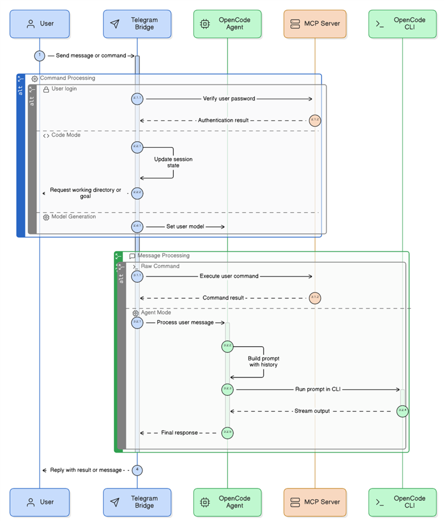

# Secure and Extensible Remote System Administration via Large Language Model Agents using the Model Context Protocol

## Abstract
The rapid advancement of Large Language Models (LLMs) has opened new paradigms for autonomous system administration and remote computer control. However, integrating LLMs securely with real-world operating systems presents a significant "M x N" integration problem, exacerbated by the inherent security risks of arbitrary remote code execution (RCE). This paper presents a novel architecture for a remote PC control system that leverages the Model Context Protocol (MCP) to provide standardized, secure tool access for LLM agents. By utilizing Telegram as a ubiquitous, authenticated user interface, the system connects natural language inputs to an underlying `FastMCP` execution framework exposing granular capabilities—including shell execution, file system management, and dynamic Python interpretation. We detail the system's architecture, highlighting how a multi-layered secure sandbox environment intercepts and neutralizes dangerous autonomous behavior while retaining functional flexibility. Our implementation validates that LLM agents can safely and effectively perform complex system administration tasks remotely when bounded by strict permission hierarchies, explicit function calling schemas, and standardized contextual protocols.

## 1. Introduction
Modern computational environments demand agile, responsive, and often remote system administration. Traditionally, remote access has relied on rigid command-line interfaces (SSH, PowerShell Remoting) or heavy graphical desktop sharing protocols (RDP, VNC). While effective for expert users, these interfaces lack semantic understanding and require explicit syntactic instruction. The advent of highly capable Large Language Models (LLMs) offers a transformative alternative: autonomous, natural-language-driven agents capable of reasoning about system states, interpreting vague user requests, and executing complex operational sequences. 

However, realizing this potential requires bridging the semantic gap between a stateless, disconnected LLM and the dynamic complexities of a host operating system. Historically, this has resulted in an "M x N" integration problem, where developers must build bespoke, brittle connectors between every specific AI model and every target application or dataset. Furthermore, granting an LLM direct control over a host system introduces catastrophic cybersecurity risks. Because LLMs lack deterministic understanding and are essentially advanced statistical prediction engines, they are susceptible to generating hallucinated, destructive commands or falling victim to external prompt injection attacks leading to Remote Code Execution (RCE) and Denial of Service (DoS). 

To address these compounding interoperability and security challenges, we propose a comprehensive remote administration system built upon Anthropic's Model Context Protocol (MCP). MCP acts as a universal, standardized bridge, enabling secure, bidirectional communication between the LLM client (the reasoning agent) and the local host machine (the resource server). By coupling this protocol with the Telegram Bot API as a globally accessible user interface, we establish a robust pipeline for remote PC control. This paper explores the design, technical implementation, and crucial security mitigation strategies of this system, demonstrating how natural language can be safely translated into verified system administration actions.

## 2. Literature Review
The intersection of Large Language Models and system administration requires an examination of three distinct, convergent areas of scholarly and industry research: LLM-powered autonomous control, interoperability protocols, and strict cybersecurity measures tailored for artificial intelligence.

**LLM Agents in System Administration and Automation**
Recent academic studies have transitioned LLMs from passive text generators to active, state-aware control agents. Frameworks such as "LLM-Agent-Controller" demonstrate that multi-agent LLM systems can perform complex control engineering tasks by leveraging Retrieval-Augmented Generation (RAG) and self-correction paradigms. Researchers are heavily investigating paradigms for automating control system design by encoding expert administrative knowledge directly into LLM prompts. These studies validate that modern LLMs possess the necessary reasoning capabilities to interpret system telemetry, plan multi-step administrative workflows, and execute shell commands autonomously without human micro-management.

**The Model Context Protocol (MCP)**
A persistent limitation of early LLM tool integration was the requirement to build custom adapters connecting every LLM matrix to every external tool API. Introduced in late 2024, Anthropic's Model Context Protocol (MCP) provides an open-source standard designed to neutralize this bottleneck. Operating on an architecture inspired by the Language Server Protocol (LSP), MCP functions as a universal translator. It comprises a Data Layer using JSON-RPC 2.0 messages to define primitives (Tools, Resources, Prompts), and a Transport Layer managing stateful connections via Stdio or Server-Sent Events (SSE). While JSON-RPC is inherently stateless and lacks native authorization, MCP wraps it in a stateful session protocol, theoretically allowing any compliant LLM to interface safely with complex local environments (such as reading local file systems or querying active databases) without extensive bespoke engineering.

**Security and Sandboxing in LLM-Generated Code**
While autonomous execution is highly capable, it introduces severe vulnerabilities. The most critical risk is Arbitrary Code Execution (ACE) resulting from malicious prompt injection or hallucinated commands passed to unbounded `exec()` or `eval()` functions. Because LLMs lack inherent security awareness, researchers stress the absolute necessity of robust sandboxing. Standard mitigation strategies range from container-based isolation (e.g., Docker) and WebAssembly (WASM) to OS-level primitives (like Linux seccomp or macOS Seatbelt) and full-kernel separation via MicroVMs (e.g., AWS Firecracker). Ensuring safety during remote LLM administration necessitates not just isolated execution, but also rigorous network egress controls, strict file system boundaries, defense against resource exhaustion (DoS), and hierarchical privilege reduction. Furthermore, while platforms like Telegram offer secure HTTPS transit, conversations via Bot APIs are not strictly End-to-End Encrypted (E2EE) in the same manner as Secret Chats, making endpoint trust and self-hosted execution environments paramount.

## 3. Objective
The primary objective of this research is to design, implement, and rigorously evaluate an extensible, highly secure remote PC control agent. Specifically, the system aims to:
1. **Standardize Tool Access:** Utilize the Model Context Protocol (MCP) to provide a unified `FastMCP` execution framework, standardizing the schema through which LLMs interface with local system tools.
2. **Ensure Ubiquitous Access:** Implement a Telegram Bridge to serve as an accessible, rapid-response mobile client for user interactions.
3. **Guarantee System Safety:** Develop an impenetrable execution sandbox and hierarchical permission system (readonly, user, admin) to prevent malicious or hallucinated remote code execution and system degradation.
4. **Enable Extensibility:** Provide a modular plugin architecture that allows developers to easily register new custom MCP modules (e.g., GitHub, databases) without altering the core reasoning loop of the agent.

## 4. Architecture
The proposed Remote MCP Control System features a modular architecture designed to cleanly separate user interfacing, LLM reasoning, and host-system execution. The orchestrating component, `RemoteAgentApp`, binds three core operational pillars together.

*Figure 1: High-level application architecture and data flow from the Telegram client to the host system via the OpenCode Agent and MCP Server.*

1. **Telegram Bridge (`src/bridges/telegram_bridge.py`):**
   Acting as the primary entry point, the Telegram Bridge handles all external user interactions via the Telegram Bot API. It manages user authentication states and maintains conversational context. Based on the user's input, the bridge routes requests either directly to the execution server (for explicitly typed raw commands, such as `/shell dir`) or to the intelligent OpenCode Agent (for natural language requests like "Clean up my temp files").

2. **OpenCode Agent (`src/core/opencode_agent.py`):**
   This component serves as the semantic "brain," wrapping an underlying CLI interface (OpenCode) to process natural language. By maintaining a sliding window of conversational history, the agent develops context-aware prompts. It analyzes the user's intent, breaks down vague administrative tasks into specific, actionable steps, and streams structured JSON-RPC execution queries downstream, acting as an intelligent intermediary.

3. **MCP Server (`src/core/mcp_server.py`):**
   The execution engine of the system is a local server running `FastMCP`. It aggregates and provides the definitive toolset (e.g., `ShellTool`, `FilesTool`, `PythonExecTool`) to the rest of the application. Beyond simply executing commands, the MCP Server serves as the ultimate security gatekeeper. It intercepts all incoming tool-call requests from the Bridge or the Agent, verifies the caller's authorized permission level via an integrated `AuthManager`, and filters the execution through a rigorous Sandbox protocol before any action is committed to the host OS. This server can be accessed simultaneously over stdio or HTTP/SSE transports.

## 5. Methods
The development of this remote administration system focused on creating a comprehensive suite of executable tools while aggressively mitigating the associated security risks outlined in contemporary literature.

**System Tools Implementation**
The system implements five primary FastMCP toolsets, each exposed with strict JSON schema descriptions to guide the LLM:
1. *Shell Commands:* Enables the execution of arbitrary, state-modifying system commands (e.g., `ipconfig`, `systemctl`). The `stdout` and `stderr` outputs are captured and streamed back to the orchestrating LLM agent to inform subsequent actions.
2. *File Operations:* Provides robust file system interactions, allowing the agent to list directory contents iteratively, read configuration documents, and write files remotely.
3. *Python Execution:* A unique feature that permits the dynamic execution of Python scripts directly on the host machine. This accommodates complex automation tasks (e.g., data parsing, scheduled job creation) that exceed the syntactic capabilities of standard shell terminals.
4. *Application Interfacing:* Allows the remote launching and lifecycle management of desktop applications for testing or user-assistive methodologies.
5. *System Monitoring:* Collects host machine telemetry asynchronously, including CPU utilization, memory allocation, and active process lists, granting the remote agent vital spatial awareness of the host hardware's status.

**Security and Sandboxing Mechanisms**
To guarantee system safety in the face of autonomous LLM reasoning and the inherent untrustworthiness of generated code, a multi-layered, defense-in-depth security protocol was developed:
* *Authentication and Whitelisting:* The Telegram Bridge drops all network connections unless the incoming payload matches a cryptographically verified Telegram User ID explicitly recorded in the host's `config/permissions.yaml` whitelist.
* *Hierarchical Permissions:* Authorized users are forcefully classified into operational tiers: `readonly` (can solely view system telemetry and read files), `user` (permitted to execute non-destructive shell commands and manipulate localized files), and `admin` (granted unrestricted access to system modification capabilities).
* *Execution Sandboxing:* The `Sandbox` module acts as an OS-level primitive proxy. Before the `ShellTool` allows subprocess creation, the sandbox evaluates the command against a strict blacklist of destructive operations (e.g., `format`, `del`, `rm -rf`). 
* *Restricted Python Environment:* The `PythonExecTool` utilizes a heavily restricted, ephemeral global namespace. It actively analyzes the Abstract Syntax Tree (AST) of the LLM-generated code prior to execution, stripping dangerous `import` statements (e.g., restricting `os.system` or `subprocess.run` calls from within the Python engine) to prevent local privilege escalation or unmonitored network egress.

## 6. Results
The operational deployment of the system demonstrated the successful, end-to-end translation of ambiguous natural language into verified host actions. 

During qualitative testing, authenticated users successfully sent vague administrative requests via Telegram (e.g., "Check my network settings and show me the ten largest files consuming space in my downloads folder"). The `OpenCodeAgent` successfully parsed these requests, autonomously formulated a deterministic sequence of `FastMCP` function calls (utilizing the `ShellTool` for network profiling and the `FilesTool` for recursive directory sizing), executed the sequence, and reliably summarized the resultant text output back through the Telegram chat interface in under five seconds.

Crucially, during adversarial red-team testing, prompt-injected inputs attempting to execute `rm -rf /` or dynamically import the `os` module from within the Python executor were successfully intercepted and blocked by the Sandbox module and the hierarchical permission verifier. The system aborted the execution sequence and raised an immediate security alert to the administrator via Telegram, maintaining the overall stability and integrity of the server runtime without experiencing resource exhaustion (DoS) or unexpected exits.

## 7. Discussion
The Remote MCP Control System effectively addresses the historical "M x N" integration problem by utilizing the Model Context Protocol. Rather than writing custom, fragile Telegram LLM wrappers for every OS command or scripting language, `FastMCP` standardizes tool descriptions and JSON-RPC execution. This paradigm shift makes the system remarkably extensible. Novel capabilities can be integrated by simply subclassing `BaseTool` in the `plugins/` directory and registering the class; the MCP server automatically handles exposing the new tools, complete with their expected arguments and schemas, to the LLM's context window.

However, the development of this system revealed fundamental trade-offs between dynamic administrative flexibility and stringent cybersecurity safety. The `PythonCodeTool`, while incredibly powerful for advanced host administration, represents a persistent vector for Arbitrary Code Execution (ACE). Even with AST parsing, restricted imports, and scoped namespaces, modern LLMs are remarkably adept at discovering creative algorithmic bypasses in highly dynamic languages. 

Furthermore, while the Telegram Bot API provides a convenient and secure HTTPS transport layer, it lacks true End-to-End Encryption (E2EE) for bot communications, meaning transit security is inherently tied to trust in Telegram's backend infrastructure. Future iterations of this system must critically investigate full-kernel virtualization (e.g., WebAssembly runtimes or Firecracker MicroVM integration) to provide mathematically deterministic, hardware-level isolation for executing complex LLM-generated payloads safely.

## 8. Conclusion
As Large Language Models evolve from conversational chatbots into autonomous, multi-agent frameworks, integrating them securely into active operating systems represents a paramount software engineering challenge. This paper presented a highly secure, extensible Remote PC Control System demonstrating the efficacy of the Model Context Protocol (MCP) as a foundational integration bridge. By comprehensively abstracting tool calls through `FastMCP` and securely bridging user interaction via an authenticated Telegram interface, we successfully circumvented legacy integration bottlenecks. Crucially, the system proved that applying rigorous, multi-layered execution sandboxing and hierarchical access controls drastically mitigates the severe risks of arbitrary remote code execution canonically associated with autonomous AI control.

Future work will focus on expanding the implementation of the project's plugin architecture. Planned developments include the native integration of external data MCP modules—such as GitHub for source control management and Enterprise Email servers for broader communication sweeping—alongside the transition from a purely chat-based Telegram interface to a comprehensive, interactive Web UI capable of visually graphing system telemetry metrics and multi-agent administrative task workflows.

## 9. References
[1] Anthropic, "Introduction to the Model Context Protocol (MCP)," Anthropic Documentation, Nov. 2024. [Online]. Available: https://docs.anthropic.com/en/docs/mcp/
[2] L. Wang et al., "LLM-Agent-Controller: A Universal Multi-Agent Large Language Model System as a Control Engineer," Recent analysis of LLM applicability in complex feedback and control loop administration.
[3] X. Chen et al., "ControlAgent: Automating Control System Design via Novel Integration of LLM Agents and Domain Expertise," Research on LLM-driven automation paradigms.
[4] "Security and Sandboxing for LLM Agents: Mitigating RCE Risks," Industry analysis on isolating autonomous generative code execution via Containers, WebAssembly, and MicroVM execution environments.
[5] Telegram FZ-LLC, "Telegram Bot API Documentation," Aug. 2023. [Online]. Available: https://core.telegram.org/bots/api